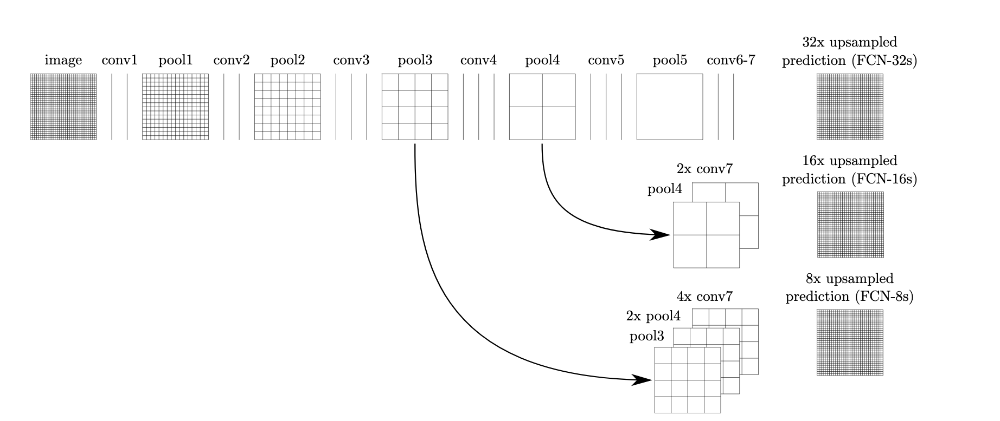
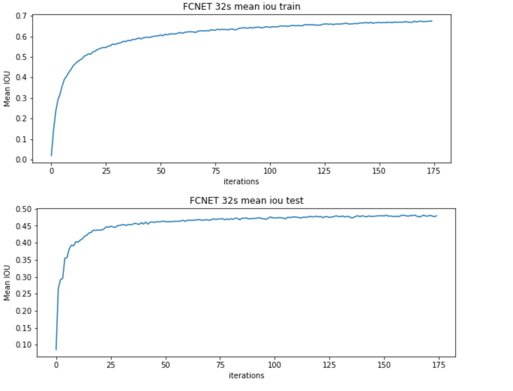
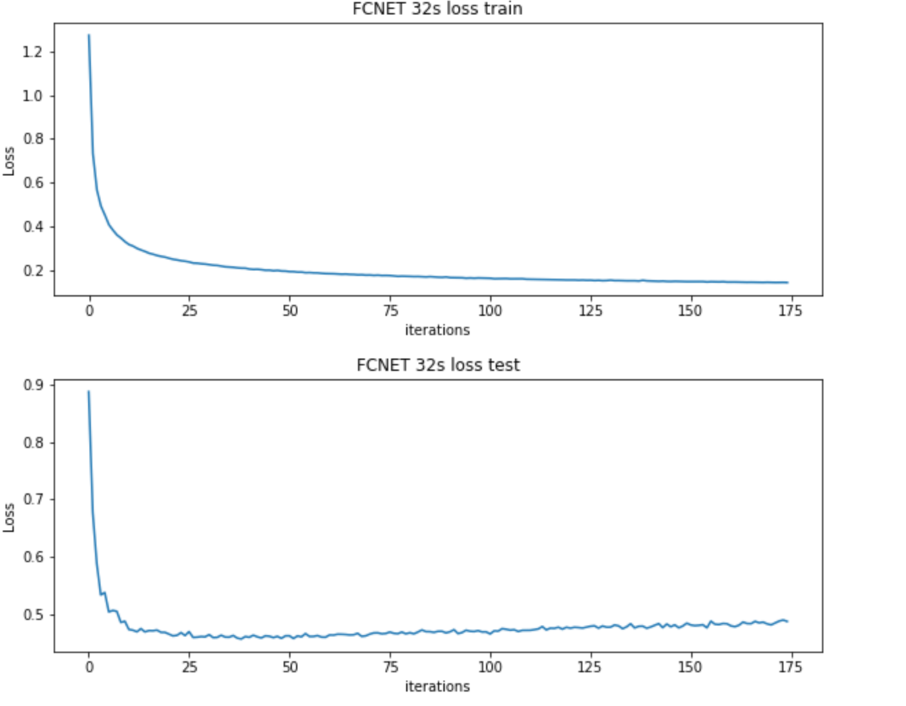
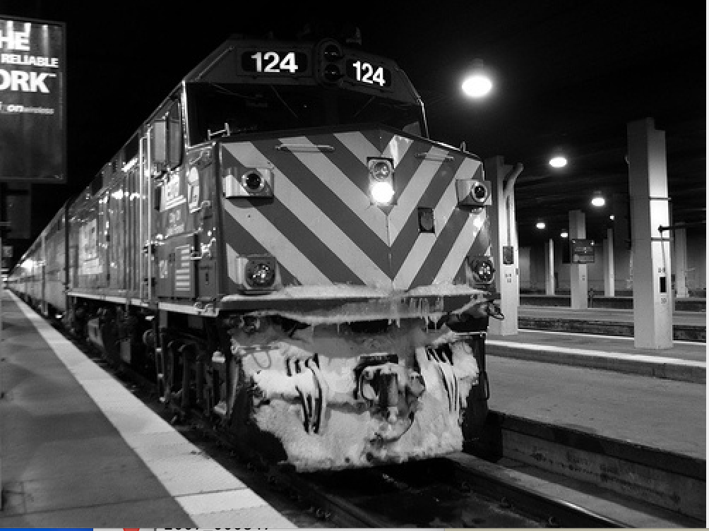
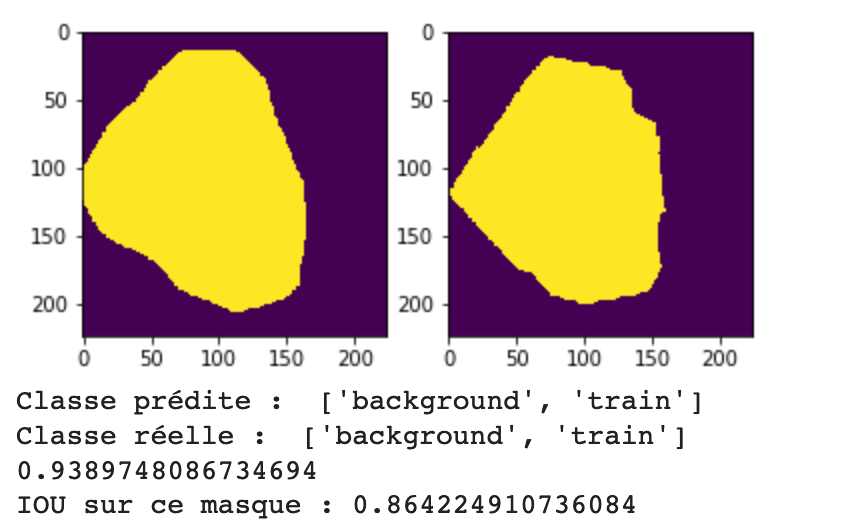

# State of the arts segmentations models
## Fully Convolutional Neural Network for Semantic Segmentation
https://people.eecs.berkeley.edu/~jonlong/long_shelhamer_fcn.pdf

### Results on VOC 2012

