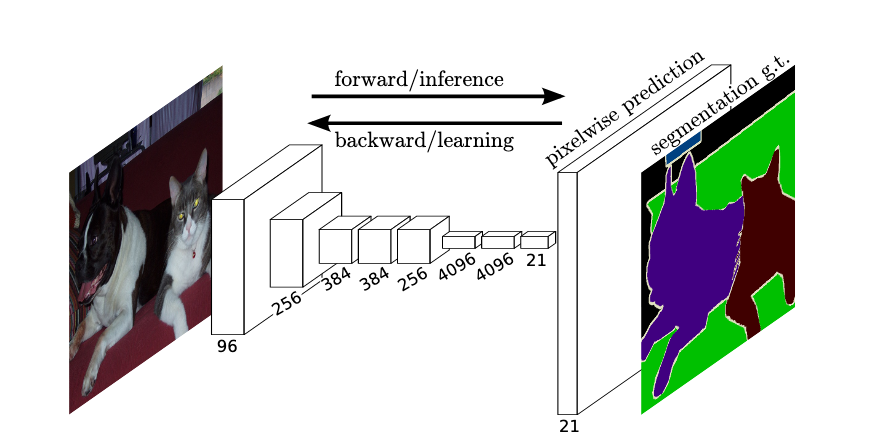
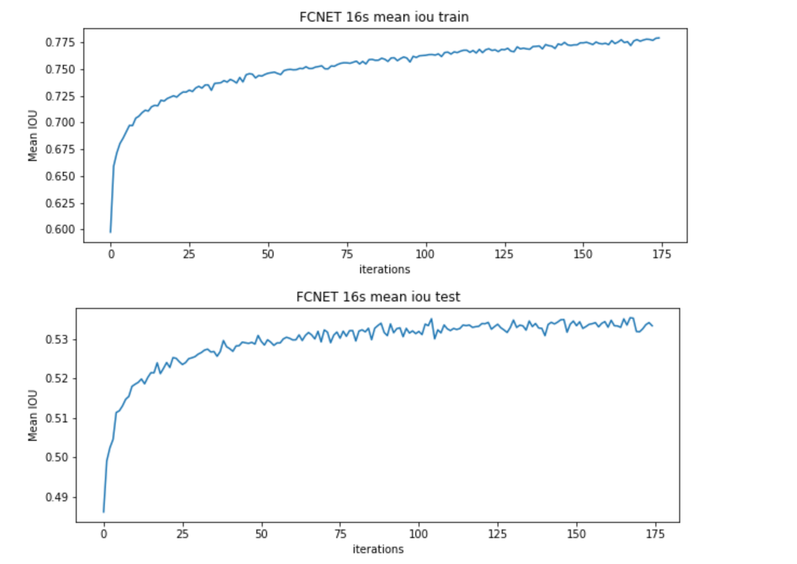
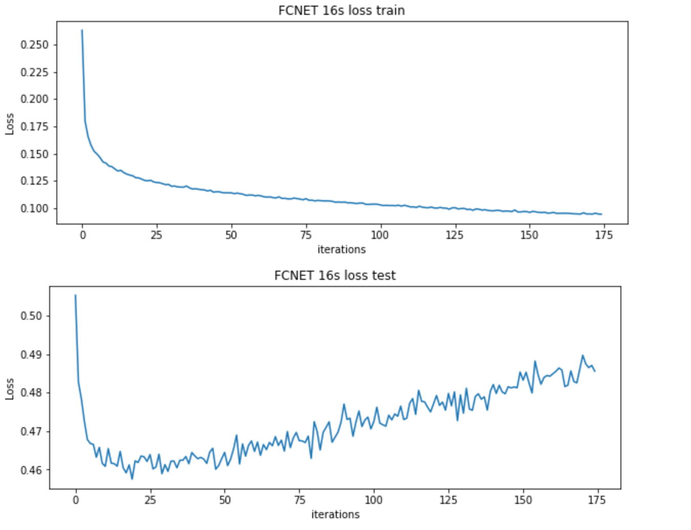
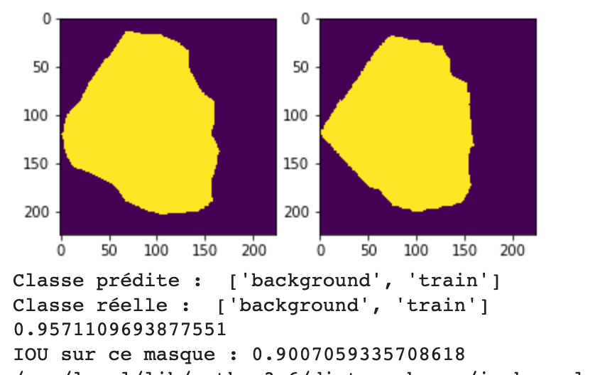
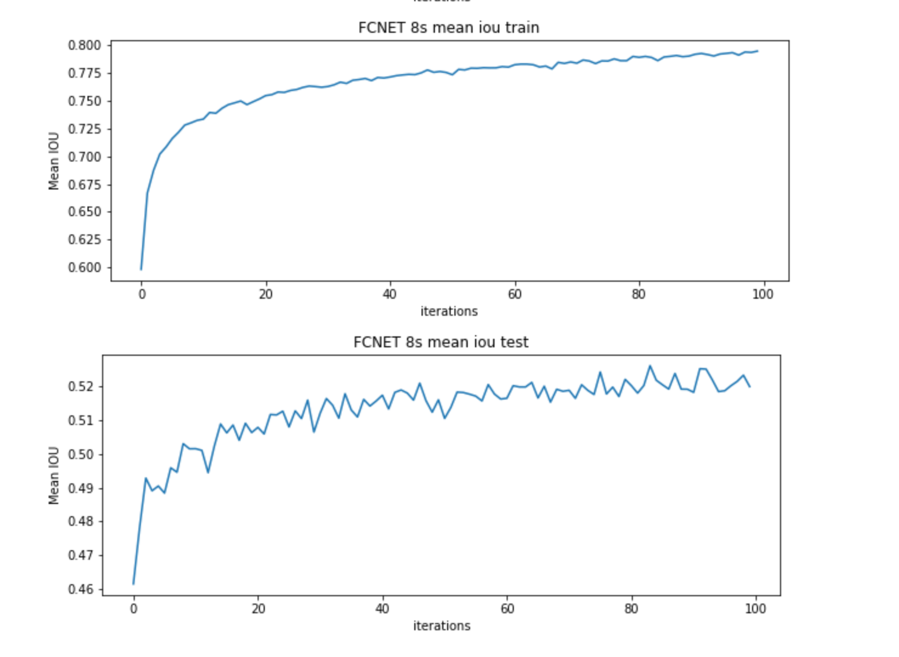
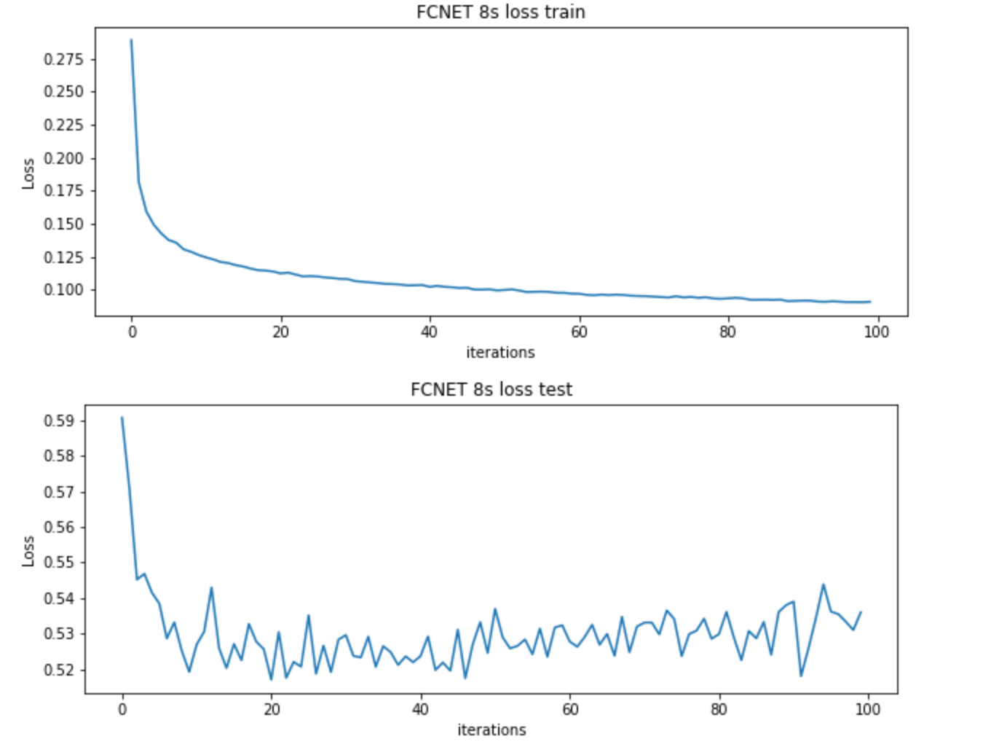
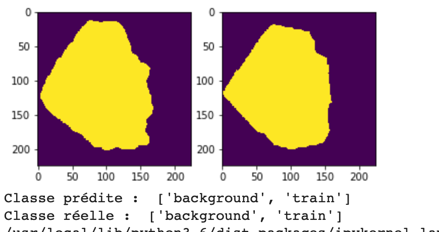
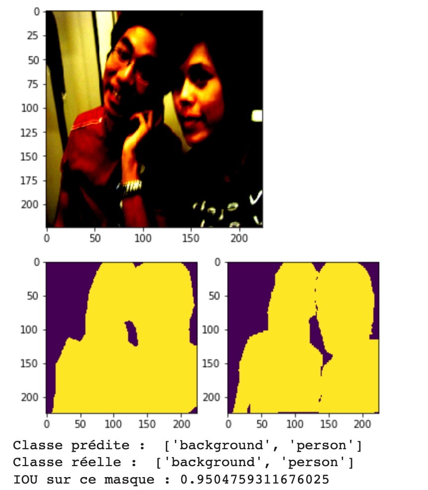
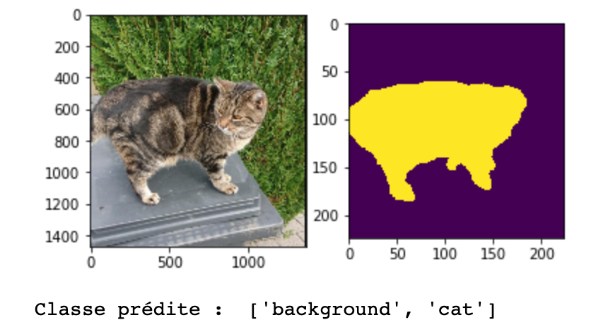

# State of the arts segmentations models

Implementation and experiments are detailed in the notebooks/

## Fully Convolutional Neural Network for Semantic Segmentation
https://people.eecs.berkeley.edu/~jonlong/long_shelhamer_fcn.pdf

### Results on VOC 2012

#### FCN 32

   

#### FCN 16

 

#### FCN 8 

 

 

Test on a picture of my cat :

